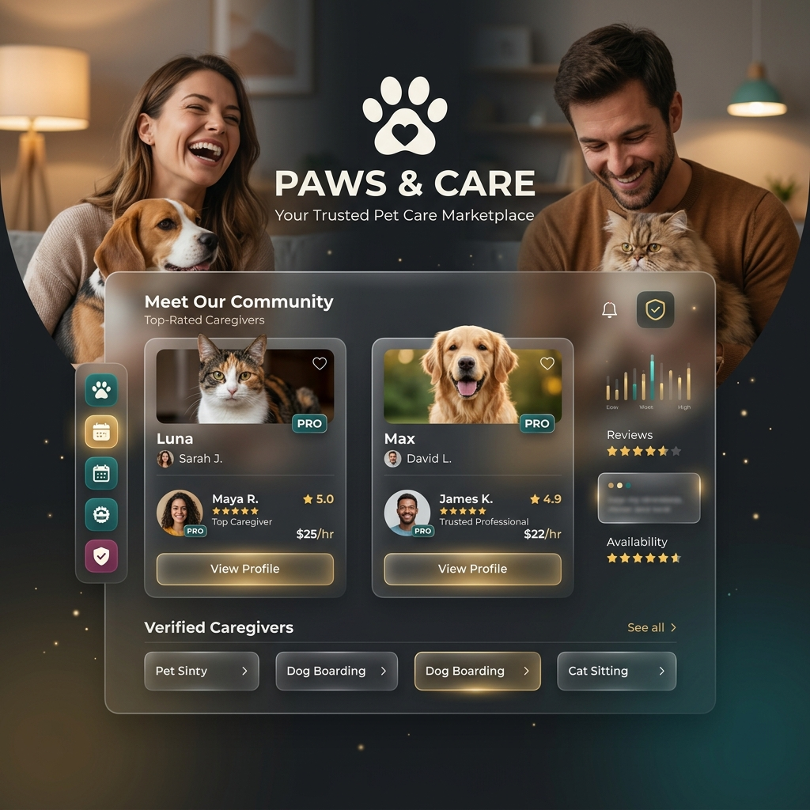

# Paws & Care | Premium Pet Care Marketplace 🐾

<div align="center">

[](https://nextjs.org/)
[](https://react.dev/)
[](https://tailwindcss.com/)
[](https://www.prisma.io/)
[](LICENSE)

**A sophisticated, full-stack pet care marketplace connecting pet owners with verified caregivers.**

[✨ Live Demo](https://pet-care-app-five.vercel.app/) • [🛠️ Setup Guide](#-getting-started) • [📋 Features](#-key-features)

</div>

---

## 📸 Project Showcase

<div align="center">
  
</div>

---

## ✨ Key Features

### 🐕 For Pet Owners
* **Smart Search & Filter System:** Find caregivers by price range, rating, location, and specific services (dog walking, grooming, boarding).
* **Interactive Map Integration:** Visualize caregiver locations and check distance instantly.
* **Premium Pro Membership:** Unlock premium caregivers, get unlimited bookings, and highlight your profile with a **PRO** badge.
* **Integrated Wallet System:** Simulated digital wallet to manage booking expenses, top-ups, and payment history.
* **Pet Health Center:** Manage records for vaccinations, dietary plans, and veterinarian details in a centralized dashboard.

### 🐱 For Caregivers (Partners)
* **Partner Dashboard:** Complete analytics for earnings, reviews, and booking volume.
* **Real-time Booking Control:** Review, accept, or decline booking requests dynamically.
* **Earnings Breakdown:** Monitor completed bookings, pending payouts, and historical income statements.
* **Video Consultation:** Direct communication link triggers for video check-ins.

---

## 🛠️ Tech Stack & Architecture

* **Frontend Framework:** Next.js 14 (App Router) & React 18
* **Styling:** Tailwind CSS (Modern, fluid layouts)
* **Animations:** Framer Motion (Smooth UI transitions)
* **Database & ORM:** Prisma ORM with SQLite (Local dev) / PostgreSQL (Production)
* **Authentication:** NextAuth.js (Secure session management)
* **Icons:** Lucide React (Premium, consistent iconography)

---

## 🏁 Getting Started

Follow these steps to run the application locally on your machine.

### Prerequisites
Make sure you have [Node.js](https://nodejs.org/) (v18 or higher) and [npm](https://www.npmjs.com/) installed.

### Installation

1. **Clone the repository:**
   ```bash
   git clone https://github.com/kashish16635/Pet-Care-App.git
   cd Pet-Care-App
   ```

2. **Install dependencies:**
   ```bash
   npm install
   ```

3. **Configure environment variables:**
   Create a `.env` file in the root directory and add the following:
   ```env
   DATABASE_URL="file:./dev.db"
   NEXTAUTH_SECRET="your-development-jwt-secret-key-change-in-production"
   ```

4. **Initialize the Database (Prisma):**
   ```bash
   npx prisma generate
   npx prisma db push
   ```

5. **Run the development server:**
   ```bash
   npm run dev
   ```
   Open [http://localhost:3000](http://localhost:3000) in your browser to view the application.

---

## 📁 Directory Structure

```text
├── prisma/               # Database schemas & migrations
├── public/               # Static assets (images, icons, videos)
├── src/
│   ├── app/              # Next.js App Router (pages & API endpoints)
│   ├── components/       # Reusable UI components
│   ├── context/          # React Context (State management)
│   ├── lib/              # Database & authentication utilities
│   └── styles/           # Global stylesheets
```

---

## 📄 License

This project is licensed under the MIT License. See the [LICENSE](LICENSE) file for details.

---
<div align="center">
  Developed with ❤️ by <a href="https://github.com/kashish16635">Kashish Khichi</a>
</div>
